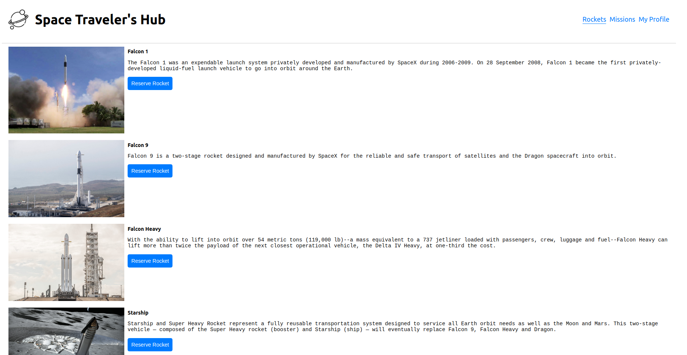

# Space Travelers Hub

> Single Page Application that fetch data from SpaceX API and lists the rockets and missions.

The objective of this exercise was to fetch the Rockets and Missions data, implement the reservation of Rockets and Missions and display them in the "My Profile" tab.

## Built With

- JavaScript/React
- React Router
- React-redux
- Redux-logger
- JSX
- CSS
- VSCode
- Webpack
- Babel
- Ubuntu 20.04.3
- Linters
- Jest

## Setup

- Get the link of the repository: `git@github.com:arthurborgesdev/space-travelers-hub.git`
- Clone it as `git@github.com:arthurborgesdev/space-travelers-hub.git` on a Terminal

## Usage

- Run `npm install` on a Terminal to install the modules
- Run `yarn start` on a Terminal to start the server 
- Open [http://localhost:3000](http://localhost:3000) to view it in the browser.

## Tests

- Run `npm test` on a Terminal to run the test suite

## Authors

👤 **Arthur Borges**

- GitHub: [@arthuborgesdev](https://github.com/arthurborgesdev)
- Twitter: [@arthurmoises](https://twitter.com/arthurmoises)
- LinkedIn: [Arthur Borges](https://linkedin.com/in/arthurmoises)

👤 **Leonardo Dias**

- GitHub: [@leonardodiasb](https://github.com/leonardodiasb)
- Twitter: [@BussularDias](https://twitter.com/BussularDias)
- LinkedIn: [Leonardo Dias Bussular](https://www.linkedin.com/in/leonardo-dias-bussular-a67392178/)

## 🤝 Contributing

Contributions, issues, and feature requests are welcome!

## Show your support

Give a ⭐️ if you like this project!

## Acknowledgments

- Microverse
- React, Redux and React Router documentation
- Lots and lots of Stack Overflow questions and answers
